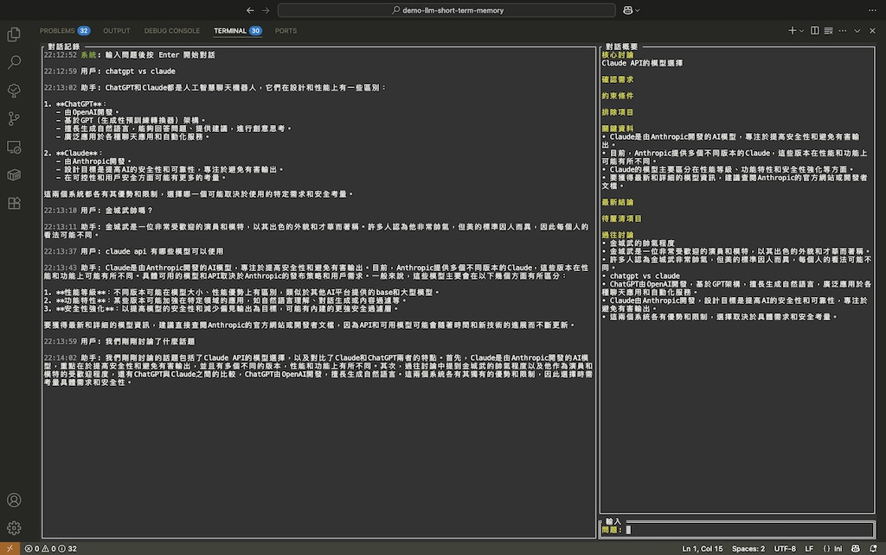

> [!Note]
> This content is translated by LLM. Original text can be found [here](README.zh.md)

# LLM Short-Term Memory Solution Study
> Attempting to solve the problem of "LLMs getting lost in multi-turn conversations" by **simulating human conversation patterns**.<br>
> Reference paper: [LLMs Get Lost In Multi-Turn Conversation](https://arxiv.org/abs/2505.06120)<br>
> [Quick Jump to Example](#example-usage)

[](#example-usage)

## Paper Problem Analysis
> [LLMs Get Lost In Multi-Turn Conversation](https://arxiv.org/abs/2505.06120)

### Common LLM Issues in Long Conversations
Research on **15 LLMs across 200,000+ conversations** shows:
- Problem:<br>
  Multi-turn conversation performance drops 39%
- Cause:<br>
  LLMs use "complete memory" models instead of human-like selective memory

### Four Key Issues

| LLM Problem | Human Behavior | New Solution |
| - | - | - |
| **Premature Solutions** | Ask clarifying questions first | - |
| **Information Hoarding** | Forget irrelevant details | Structured summaries retaining only relevant info |
| **Linear Replay** | Maintain "current state" | Refresh summary each turn + dynamic history retrieval |
| **Verbose Spirals** | Stay focused | - |

## Real Conversation Process

### Continuously Updating Mental Summary

- Humans don't repeatedly go through entire conversation history in their minds
- Instead, they maintain a dynamic "current understanding" and update conclusions based on new information
- Past details fade or disappear, but key conclusions and constraints persist

### Keyword-Triggered Recall

- When someone says "that thing we discussed earlier"
- We perform fuzzy searches of recent memory for relevant information
- Only retrieve specific details when triggered by reference keywords

## Filtering Trumps Memory

**Cognitive Burden of Perfect Memory**

Research shows exceptional memory ability doesn't equal intelligence advantage. The classic neuropsychological case of [Solomon Shereshevsky](https://en.wikipedia.org/wiki/Solomon_Shereshevsky) could remember arbitrary details from decades ago, including meaningless number sequences and vocabulary lists, but "perfect memory" actually created cognitive burden. He couldn't distinguish important from unimportant information, leading to difficulties in abstract thinking and daily decision-making.

### Design Insights for LLMs
Traditional LLMs using complete memory models may actually be simulating cognitive impairment. This leads to requiring bigger, more powerful hardware support without proportional performance gains.
```
Selective attention > Complete memory
Abstract summarization > Detail preservation  
Dynamic adaptation > Fixed replay
```

## Implementation Plan

```
Human conversation process → Engineering implementation

Mental summary → Small model generates structured summary after each turn
Content recall → Automatic fuzzy search of conversation history for each question (relevance scoring)
New conversation → Latest summary + relevant history fragments + new question
```

### Human Conversation Simulation

> **Simulating imperfect memory**: Instead of designing better, larger information retrieval support, we built a system that processes information like humans do

#### Humans Are Inherently Poor at Complete Memory

- We forget irrelevant details 
- We remember key decisions 
- We learn from mistakes
- We have internal measures 
- We maintain current conversation focus
- We actively associate relevant past content

#### Combining Machine Advantages

This approach explores combining human cognitive advantages with machine computational advantages:
- Simulate human mechanisms: Default state uses only structured summaries, avoiding historical information overwhelming current conversation
- Machine enhancement: Complete conversation records are still preserved; when retrieval is triggered, can provide more precise detail recall than humans

Maintains the natural focus characteristics of human conversation while leveraging machine advantages in precise retrieval. Doesn't use complete history during conversation, only activating detailed retrieval under specific trigger conditions.

#### Engineering Simulation Focus

```
Exclude unnecessary information: Remove from key summaries
Maintain focus: Use structured summaries, similar to mental rough overviews
Active recall: Automatically retrieve relevant historical content for each question
State updates: Continuous summarization, similar to mental event understanding
```
- Don't replay complete content but use summaries to simulate human rough overviews
- Summarize into new overviews to adjust conversation direction, simulating human internal perspectives
- Actively retrieve relevant history to simulate human associative memory

#### Implementation
1. **Continuous mental perspective updates → Automatic summary updates** (relevant information retention vs complete history)<br>
  After each conversation turn, humans unconsciously update their current conversation summary based on new information and proceed with the next turn using new perspectives
2. **Active associative memory → Fuzzy search system** (automatic memory retrieval)<br>
  For each new question, automatically search relevant content in conversation history, simulating human active association of past discussions
3. **Current state focus → Fixed context structure** (structured summaries)<br>
  Dynamically adjust current conversation direction, not re-reviewing entire conversation history

| Cognitive Mode | Human Behavior | LLM | Simulation Implementation |
| - | - | - | - |
| **Memory Management** | Selective retention | Perfect recall | Structured forgetting |
| **Error Learning** | Avoid known failures | Repeat mistakes | Excluded options tracking |
| **Focus Maintenance** | Current state oriented | Historical drowning | Summary-based context |
| **Memory Retrieval** | Active associative triggering | Passive complete memory | Automatic fuzzy search |

## Memory Architecture Comparison

### LLM "Complete Memory" (Non-human conversation method)

<details>
<summary>Flowchart</summary>


</details><br>

```
Turn 1: [question 1] + [response 1]
Turn 2: [question 1] + [response 1] + [question 2] + [response 2]
Turn 3: [question 1] + [response 1] + [question 2] + [response 2] + [question 3] + [response 3]
...
Turn N: [Complete verbatim conversation record]
```
- Humans don't completely recall all content
- Old irrelevant information interferes with current content generation; humans exclude irrelevant information
- No mechanism for learning from mistakes; gets interfered by irrelevant information in long conversations
- Linear token growth leads to conversation length limits; humans don't interrupt conversations because they're too long

### Human Real Conversation Method Study

<details>
<summary>Flowchart</summary>


</details><br>

```
Each turn: [Structured current state] + [Relevant history fragments] + [New question]
```

#### Conversation Summary Design
```
Core topic of current discussion
Accumulated retention of all confirmed requirements
Accumulated retention of all constraint conditions
Excluded options + reasons
Accumulated retention of all important data, facts, and conclusions
Current topic-related questions to clarify
All important historical discussion points
```

## Fuzzy Retrieval Algorithm Design

### Multi-dimensional Scoring Mechanism
```
Total score = Keyword overlap (40%) + Semantic similarity (40%) + Time weight (20%)
```

**Keyword Overlap**
- Use Jaccard similarity to calculate vocabulary matching degree
- Support partial matching and inclusion relationships

**Semantic Similarity**
- Simplified cosine similarity, calculating common vocabulary proportion
- Suitable for Chinese-English mixed text processing

**Time Weight**
- Linear decay within 24 hours: recent=1.0, 24 hours ago=0.7
- Fixed score of 0.7 after 24 hours (suitable for long-term continuous conversations)

### Retrieval Control Mechanism
- **Relevance threshold**: Default 0.3, filters irrelevant content
- **Result quantity limit**: Return maximum 5 most relevant records
- **Keyword extraction**: Automatically filter stop words, retain meaningful vocabulary

### Context Combination Strategy
```
Each turn conversation context = [Structured summary] + [Relevant historical conversation] + [New question]
```

## Implemented
- [x] **Structured summary system**: Simulate human mental rough summaries
- [x] **State update mechanism**: Automatically update cognitive state after each conversation turn (gpt-4o-mini)  
- [x] **Error learning system**: Avoid repeated mistakes through `ExcludedOptions`
- [x] **Token efficiency optimization**: Fixed transmission of summaries and new content, no longer passing complete message streams
- [x] **Fuzzy retrieval mechanism**: Automatically retrieve relevant historical conversations as reference
- [x] **Multi-dimensional scoring algorithm**: Comprehensive relevance assessment of keywords+semantics+time
- [x] **Long conversation optimization**: Time weight design suitable for continuous conversation scenarios

## To Be Implemented
- [ ] **Semantic understanding enhancement**: Integrate more precise semantic similarity algorithms
- [ ] **Keyword extraction optimization**: More intelligent vocabulary extraction and weight allocation
- [ ] **Dynamic threshold adjustment**: Automatically adjust relevance thresholds based on conversation content
- [ ] **Conversation type identification**: Optimize memory strategies for different conversation scenarios
- [ ] **Multi-model support**: Support more LLM providers (Claude, Gemini, etc.)

## Example Usage

### Environment Requirements
- Go 1.20 or higher
- OpenAI API key

### Installation Steps

1. **Clone the project**
```bash
git clone https://github.com/pardnchiu/llm-dialogue-simulation 
cd llm-dialogue-simulation
```

2. **Configure API key**
Create an `OPENAI_API_KEY` file and put your OpenAI API key:
```bash
echo "your-openai-api-key-here" > OPENAI_API_KEY
```

Or set environment variable:
```bash
export OPENAI_API_KEY="your-openai-api-key-here"
```

3. **Run the program**
```bash
./llmsd
```
or
```bash
go run main.go
```

#### API Key Configuration
The program will look for OpenAI API key in the following order:
1. Environment variable `OPENAI_API_KEY`
2. `OPENAI_API_KEY` file in current directory
3. `OPENAI_API_KEY` file in executable directory

#### Instruction File Configuration
**INSTRUCTION_CONVERSATION**
- Defines system instructions for main conversation model (GPT-4o)
- Affects AI assistant's response style and behavior
- If file doesn't exist, will use blank instructions

**INSTRUCTION_SUMMARY**
- Defines system instructions for summary generation model (GPT-4o-mini)
- Affects conversation summary update logic and format
- If file doesn't exist, will use blank instructions

### Usage

1. **Start the program**: After execution, displays three-panel interface
   - Left: Conversation history display
   - Top right: Conversation summary display
   - Bottom right: Question input field

2. **Basic operations**:
   - `Enter`: Submit question
   - `Tab`: Switch panel focus
   - `Ctrl+C`: Exit program

3. **Conversation flow**:
   - After inputting question, system automatically retrieves relevant historical conversations
   - AI provides answers based on summary and relevant history
   - System automatically updates conversation summary, maintaining memory state (wait for summary update before continuing conversation)

## License

This source code project is licensed under the [MIT](LICENSE) license.

## Author


<h4 style="padding-top: 0">邱敬幃 Pardn Chiu</h4>

<a href="mailto:dev@pardn.io" target="_blank">
  
</a> <a href="https://linkedin.com/in/pardnchiu" target="_blank">
  
</a>

***

©️ 2025 [邱敬幃 Pardn Chiu](https://pardn.io)
