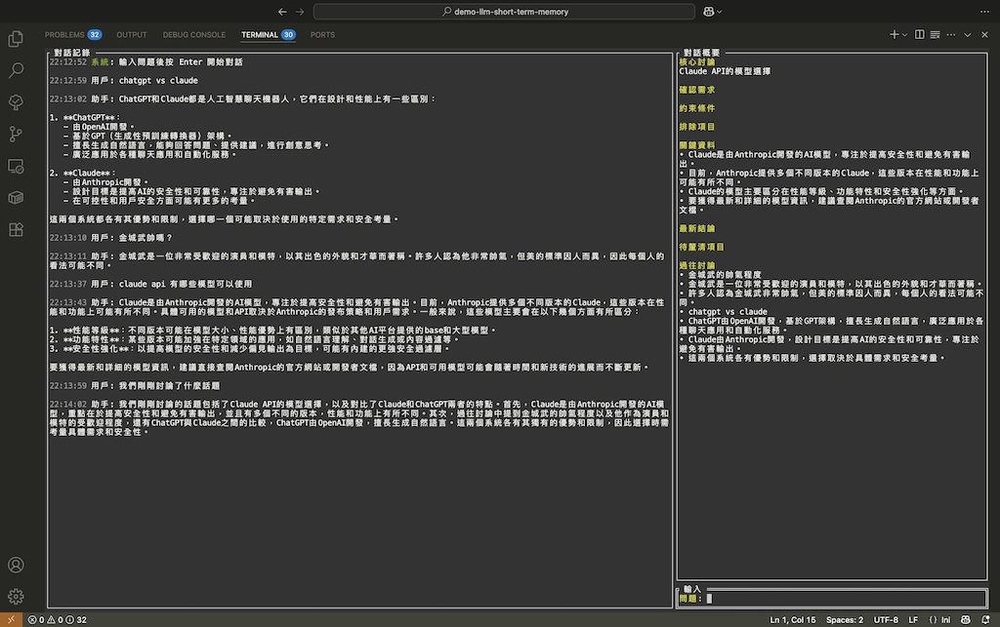

# LLM 短期記憶解決探討
> 透過**模擬人類對話方式**，嘗試解決「LLM 在多輪對話中迷失」的問題。<br>
> 參考論文來源 [LLMs Get Lost In Multi-Turn Conversation](https://arxiv.org/abs/2505.06120)



## 真實對話過程

### 持續在腦中更新摘要
- 人類不會在腦中反覆重複整個歷史對話才進行對話
- 而是維持動態的「當前理解」，並且會依據新消息而更新論點
- 過往細節會淡化甚至遺失，但關鍵結論和限制條件會持續存在

### 關鍵字觸發回想
- 當有人說「我們前面討論的那個」
- 我們會模糊搜尋近期記憶中的相關的訊息
- 只有在參考關鍵字觸發時才會檢索特定細節

### 實作規劃
```
人類對話過程 → 工程話實踐

腦中摘要 → 透過小型模型在每輪後生成結構化摘要
內容回想 → 每個問題自動模糊搜尋歷史對話（相關性評分機制）
新對話 → 最新摘要 + 相關歷史片段 + 新問題
```

## 論文問題探討
> [LLMs Get Lost In Multi-Turn Conversation](https://arxiv.org/abs/2505.06120)

### LLM 在長對話的情境下普遍問題
針對**15 個 LLM 跨越 20 萬次以上對話**的研究顯示：
- 問題：<br>
  多輪對話性能下降 39%
- 原因：<br>
  LLM 使用「完整記憶」模型而非類人的選擇性記憶

### 四大問題

| LLM 問題 | 人類行為 | 新解決方案 |
| - | - | - |
| **過早解決方案** | 會先問澄清問題 | - |
| **資訊囤積** | 會遺忘無關細節 | 結構化摘要只保留相關資訊 |
| **線性重播** | 維持「當前狀態」 | 每輪刷新摘要 + 動態檢索歷史 |
| **冗長螺旋** | 保持聚焦 | - |

## 記憶架構比較

### LLM「完整記憶」（非人類對話方式）
```
第 1 輪：[question 1] + [response 1]
第 2 輪：[question 1] + [response 1] + [question 2] + [response 2]
第 3 輪：[question 1] + [response 1] + [question 2] + [response 2] + [question] + [response 3]
...
第 N 輪：[完整對話逐字記錄]
```
- 人類不會完整回憶所有內容
- 舊的無關資訊干擾當前內容生成，人類會排除無關訊息
- 沒有從錯誤中學習的機制，在長對話會被無關訊息干擾
- 線性增長的 Token 導致對話串長度限制，人類不會因為一個對話過長而中斷

### 模擬人類真實對話方法探討
```
每一輪：[結構化當前狀態] + [相關歷史片段] + [新問題]
```

#### 對話概要設計
```
當前討論的核心主題
累積保留所有確認的需求
累積保留所有約束條件
被排除的選項+原因
累積保留所有重要資料和事實與所有結論
當前主題相關的待釐清問題
所有重要的歷史討論點
```

## 人類對話模擬
> **模擬不完整記憶**：不是設計更好、更大的資訊檢索的支持，而是建造了像人類一樣處理資訊的系統

### 人類本質上不善於完整記憶
- 我們遺忘無關細節 
- 我們記住關鍵決策 
- 我們從錯誤中學習
- 我們內心都有把尺 
- 我們維持當前對話焦點
- 我們會主動聯想相關的過往內容

## 篩選勝過記憶

**完美記憶的認知負擔**

研究發現，異常記憶能力並不等同於智能優勢。神經心理學經典案例 [Solomon Shereshevsky](https://en.wikipedia.org/wiki/Solomon_Shereshevsky) 能記住數十年前的任意細節，包括無意義的數字序列和詞彙表，但「完美記憶」反而造成認知負擔。他無法區分重要與不重要的資訊，導致抽象思考與日常決策困難。

### 給 LLM 設計的啟示
傳統 LLM 採用完整記憶模型，實際上可能是在模擬認知障礙。導致結果需要追求更大更強的硬體支援，卻依舊無法給出等比例的成長。
```
選擇性注意 > 完整記憶
抽象總結 > 細節保存  
動態適應 > 固定重播
```

### 結合機器優勢
本方法探討如何結合了人類認知優勢與機器計算優勢：
- 模擬人類機制：預設狀態僅使用結構化摘要，避免歷史資訊淹沒當前對話
- 機器補強：完整對話記錄依然保存，當觸發檢索時能提供比人類更精確的細節回想

保持了人類對話的自然聚焦特性，又利用了機器在精確檢索上的優勢。對話當下不使用完整歷史串，只在特定觸發條件下才啟動詳細檢索。

### 工程模擬重點
```
排除不必要的資訊：從關鍵概要中移除
聚焦維持：使用結構化摘要，類似腦中攏統概要
主動回想：每個問題自動檢索相關歷史內容
狀態更新：持續摘要，類似腦中的事件理解
```
- 不對完整內容做重播而是改為概要模擬人類籠統概要
- 總結為新概要來調整對話主軸模擬人類內心的觀點
- 主動檢索相關歷史模擬人類聯想記憶

#### 實作
1. **持續更新腦中觀點 → 自動摘要更新**（相關性的資訊保留 vs 完整歷史）<br>
  每次對話過程後，人類會無意識的情況下針對新接收的資訊更新對當前對話的總結，並以新觀點進行下一輪對話
2. **主動聯想記憶 → 模糊搜尋系統**（自動記憶檢索）<br>
  針對每個新問題，自動搜尋歷史對話中的相關內容，模擬人類主動聯想過往討論
3. **當前狀態聚焦 → 固定脈絡架構**（結構化摘要）<br>
  動態調整當前對話主軸，非重新 review 整個對話歷史

| 認知模式 | 人類行為 | llm | 模擬實作 |
| - | - | - | - |
| **記憶管理** | 選擇性保留 | 完美回憶 | 結構化遺忘 |
| **錯誤學習** | 避免已知失敗 | 重複錯誤 | 排除選項追蹤 |
| **聚焦維持** | 當前狀態導向 | 歷史淹沒 | 基於摘要的脈絡 |
| **記憶檢索** | 主動聯想觸發 | 被動完整記憶 | 自動模糊搜尋 |

## 模糊檢索算法設計

### 多維度評分機制
```
總分 = 關鍵詞重疊(40%) + 語義相似度(40%) + 時間權重(20%)
```

**關鍵詞重疊**
- 使用 Jaccard 相似度計算詞彙匹配程度
- 支援部分匹配和包含關係

**語義相似度**
- 簡化版餘弦相似度，計算共同詞彙比例
- 適合中英文混合文本處理

**時間權重**
- 24小時內線性衰減：最近=1.0，24小時前=0.7
- 超過24小時後固定分數0.7（適合長時間持續對話）

### 檢索控制機制
- **相關性閾值**：預設0.3，過濾無關內容
- **結果數量限制**：最多返回5條最相關記錄
- **關鍵詞提取**：自動過濾停用詞，保留有意義詞彙

### 上下文組合策略
```
每輪對話上下文 = [結構化概要] + [相關歷史對話] + [新問題]
```

## 已實現
- [x] **結構化概要系統**：模擬人類的腦中攏統概要
- [x] **狀態更新機制**：每輪對話後自動更新認知狀態（gpt-4o-mini）  
- [x] **錯誤學習系統**：通過 `ExcludedOptions` 避免重複錯誤
- [x] **Token 效率優化**：固定傳送概要與新內容，不再是以完整訊息串傳遞
- [x] **模糊檢索機制**：自動檢索相關歷史對話作為參考
- [x] **多維度評分算法**：關鍵詞+語義+時間的綜合相關性評估
- [x] **長對話優化**：適合持續對話場景的時間權重設計

## 待實現
- [ ] **語義理解增強**：整合更精確的語義相似度算法
- [ ] **關鍵詞提取優化**：更智能的詞彙提取和權重分配
- [ ] **動態閾值調整**：根據對話內容自動調整相關性閾值
- [ ] **對話類型識別**：針對不同對話場景優化記憶策略
- [ ] **多模型支援**：支援更多 LLM 提供商（Claude、Gemini 等）

## 範例使用

### 環境要求
- Go 1.20 或更高版本
- OpenAI API 金鑰

### 安裝步驟

1. **複製專案**
```bash
git clone https://github.com/pardnchiu/llm-dialogue-simulation 
cd llm-dialogue-simulation
```

2. **配置 API 金鑰**
創建 `OPENAI_API_KEY` 檔案並放入您的 OpenAI API 金鑰：
```bash
echo "your-openai-api-key-here" > OPENAI_API_KEY
```

或設定環境變數：
```bash
export OPENAI_API_KEY="your-openai-api-key-here"
```

3. **執行程式**
```bash
./llmsd
```
或是
```bash
go run main.go
```

#### API 金鑰配置
程式會按照以下順序尋找 OpenAI API 金鑰：
1. 環境變數 `OPENAI_API_KEY`
2. 當前目錄的 `OPENAI_API_KEY` 檔案
3. 執行檔同目錄的 `OPENAI_API_KEY` 檔案

#### 指令檔案配置
**INSTRUCTION_CONVERSATION**
- 定義主要對話模型（GPT-4o）的系統指令
- 影響 AI 助手的回答風格和行為
- 如果檔案不存在，將使用空白指令

**INSTRUCTION_SUMMARY**
- 定義概要生成模型（GPT-4o-mini）的系統指令
- 影響對話概要的更新邏輯和格式
- 如果檔案不存在，將使用空白指令

### 使用方式

1. **啟動程式**：執行後會顯示三面板介面
   - 左側：對話記錄顯示
   - 右上：對話概要顯示
   - 右下：問題輸入欄位

2. **基本操作**：
   - `Enter`：送出問題
   - `Tab`：切換面板焦點
   - `Ctrl+C`：退出程式

3. **對話流程**：
   - 輸入問題後，系統會自動檢索相關歷史對話
   - AI 基於概要和相關歷史提供回答
   - 系統自動更新對話概要，保持記憶狀態（請等摘要更新完在進行對話）

## 授權條款

此源碼專案採用 [MIT](LICENSE) 授權條款。

## 作者


<h4 style="padding-top: 0">邱敬幃 Pardn Chiu</h4>

<a href="mailto:dev@pardn.io" target="_blank">
  
</a> <a href="https://linkedin.com/in/pardnchiu" target="_blank">
  
</a>

***

©️ 2025 [邱敬幃 Pardn Chiu](https://pardn.io)
